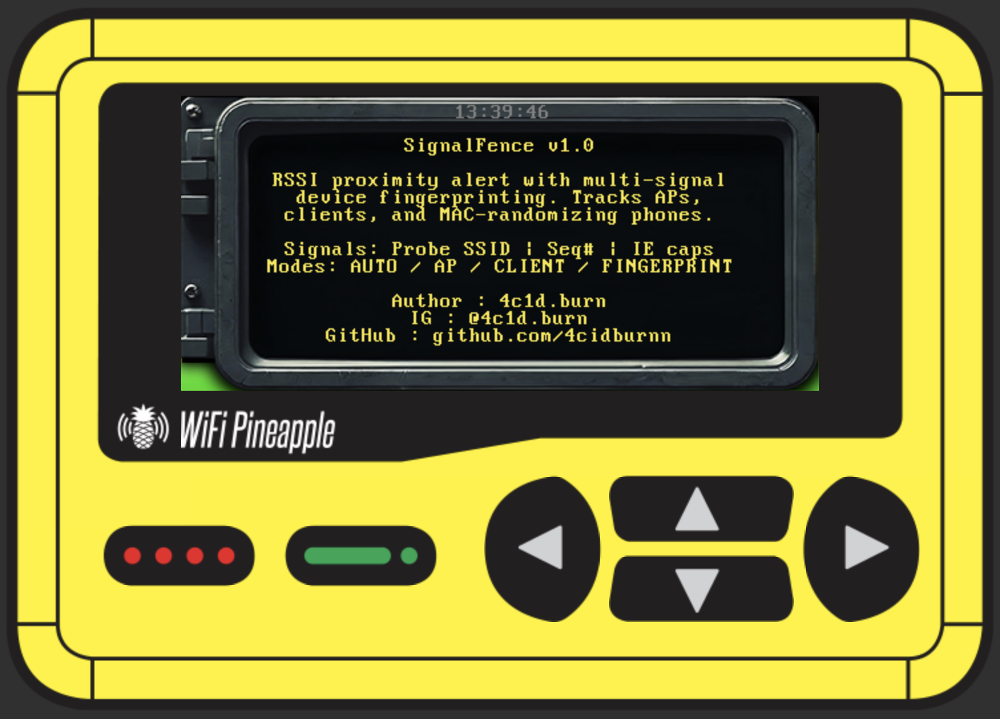
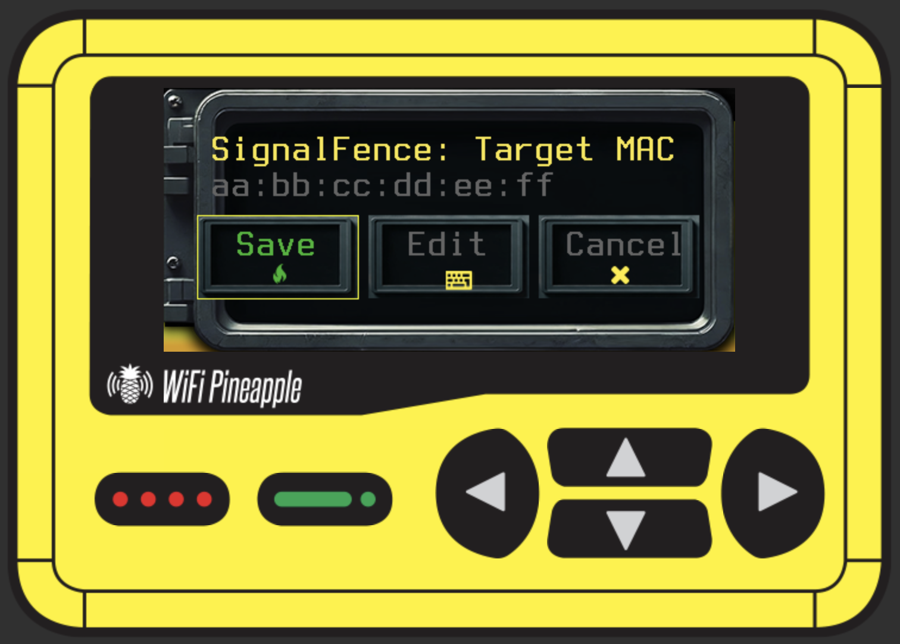
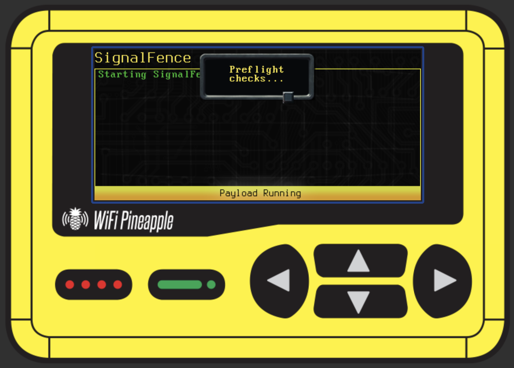
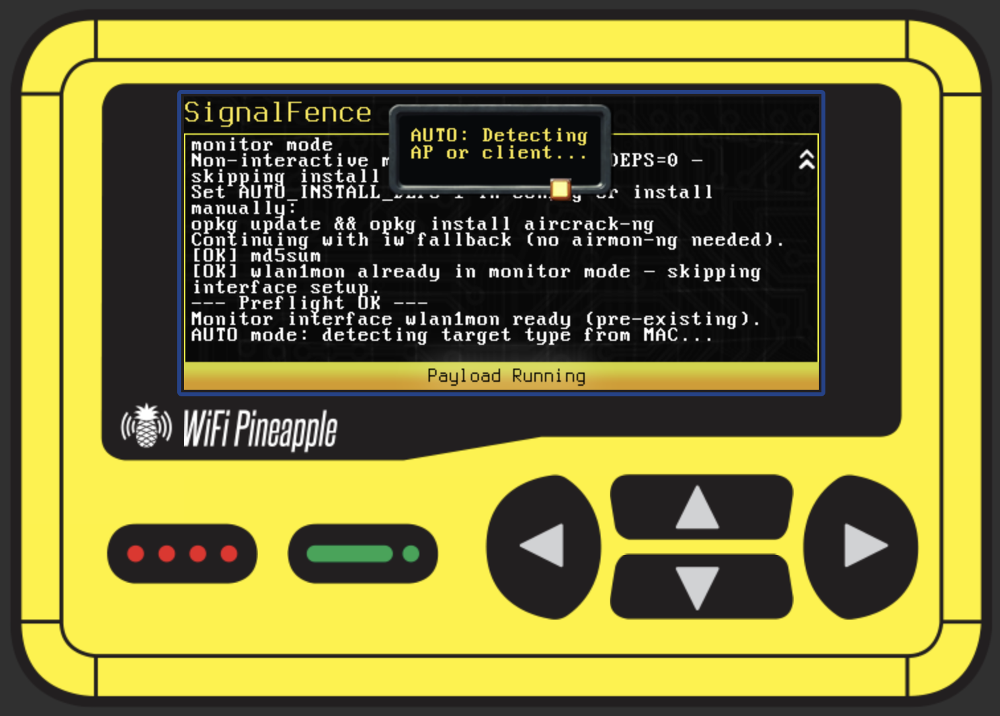
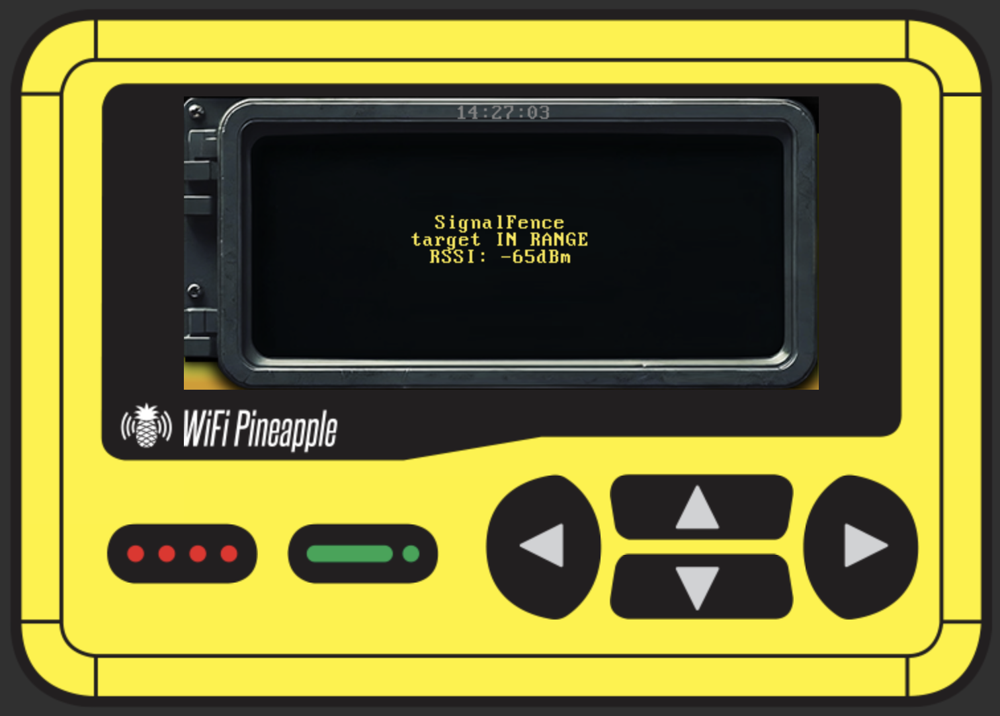

# SignalFence

[](https://hak5.org/products/wifi-pineapple-pager)
[](https://github.com/4cidburnn/SignalFence)
[](https://github.com/hak5/wifipineapplepager-payloads)
[](#legal)

**RSSI-based proximity alert with multi-signal device fingerprinting for the Hak5 WiFi Pineapple Pager.**

Track any wireless device — AP, client, or MAC-randomizing phone — and get alerted the moment it enters a configurable signal threshold. No laptop needed. Fully self-contained on the Pager.

---

> 

---

## What it does

SignalFence passively monitors the airspace in monitor mode and watches for a single target device. When that device's signal crosses a configurable RSSI threshold, it fires:

- **On-screen alert** — full-screen `ALERT` with RSSI and detected MAC
- **LED pattern** — rapid red blink × 3 → solid red hold
- **Buzzer** pulse
- **Timestamped log** at `/tmp/signalfence.log`
- **Optional webhook POST** — JSON payload to a remote listener

---

## AUTO mode — zero configuration tracking

SignalFence reads the **locally administered (LA) bit** of the MAC you enter and automatically picks the right tracking mode. You don't need to know what mode to use.

```
User enters MAC on device screen
         │
         ▼
   LA bit set? (randomized MAC)
   ├── YES ──→ FINGERPRINT mode  (3-signal engine, survives rotation)
   └── NO  ──→ Beacon check (5s)
               ├── Beacons found ──→ AP mode      (router / access point)
               └── No beacons    ──→ CLIENT mode  (non-randomizing device)
```

---

## Three tracking modes

| Mode | Target type | MAC randomization | How it works |
|---|---|---|---|
| `AP` | Router / access point | N/A — APs never randomize | Captures beacons from BSSID |
| `CLIENT` | Phone / laptop (randomization off) | ❌ Breaks on rotation | Captures any frame from MAC |
| `FINGERPRINT` | Modern phone / laptop | ✅ Survives rotation | 3-signal scoring engine |

---

## FINGERPRINT mode — how MAC randomization is bypassed

Modern Android (8+) and iOS (14+) randomize their MAC per association. `CLIENT` mode breaks immediately. `FINGERPRINT` mode tracks three signals that survive rotation:

### Signal 1 — Probe SSID set `(+3 pts)`
Every device broadcasts probe requests for its saved networks (Preferred Network List). That list is device-specific and stable across MAC rotations. SignalFence enrolls it during setup and matches against it passively.

### Signal 2 — 802.11 Sequence number continuity `(+3 pts)`
The 12-bit hardware frame counter in the radio chipset **does not reset when the MAC rotates**. If the next frame seen has `seq = last_known + N` where N is small, it's the same device regardless of what MAC it's showing. This is the signal that works against **fully silent iOS 14+ devices** — it fires on data frames, ACKs, and management frames, not just probe requests.

```
Enrollment:  real MAC aa:bb:cc:dd:ee:ff → seq 1040
Cycle 1:     random   f2:11:22:33:44:55 → seq 1043 → delta=3 ✓ MATCH
Cycle 2:     random   3e:99:ab:12:34:56 → seq 1051 → delta=8 ✓ MATCH
```

### Signal 3 — IE capability fingerprint `(+2 pts)`
The 802.11 Information Elements in probe frames (supported rates, HT capabilities, vendor OUI list) are determined by the WiFi chipset — not the OS or MAC. Same device = same IE hash regardless of rotation.

**Alert fires when score ≥ `CONFIDENCE_THRESHOLD` (default: 4/8)**

---

## Screenshots

| MAC Picker | Preflight | AUTO Detection | Alert |
|:-:|:-:|:-:|:-:|
|  |  |  |  |

> Replace the image tags above with actual screenshots. Store them in a `screenshots/` folder in your repo.

---

## Installation

**1. Clone or download**
```bash
git clone https://github.com/4cidburnn/SignalFence
```

**2. SCP to the Pager**

Connect your computer to the Pager's WiFi AP, then:
```bash
# Create the directory on the Pager
ssh root@172.16.52.1 "mkdir -p /mmc/root/payloads/user/reconnaissance/SignalFence"

# Upload both files
scp SignalFence/payload.sh root@172.16.52.1:/mmc/root/payloads/user/reconnaissance/SignalFence/
scp SignalFence/README.md  root@172.16.52.1:/mmc/root/payloads/user/reconnaissance/SignalFence/
```

> **Note:** The Pager's default IP is `172.16.52.1` and SSH password is `hak5pineapple` unless changed.

**3. Run from the Pager**

Navigate to: `Payloads → user → recon → SignalFence` and press run.

---

## Configuration

All settings are at the top of `payload.sh`. The most important ones:

```sh
TARGET_MAC="AA:BB:CC:DD:EE:FF"   # Placeholder — MAC_PICKER will prompt on device
TARGET_TYPE="AUTO"                # AUTO is recommended. Override: AP / CLIENT / FINGERPRINT
TARGET_LABEL="target"            # Name shown in logs and alerts

RSSI_THRESHOLD="-70"             # Alert when signal >= this (dBm)
CONFIDENCE_THRESHOLD="4"         # FINGERPRINT: min score to fire (3=aggressive, 5=strict)
SEQ_DELTA_TOLERANCE="100"        # Max seq gap for continuity match
```

### RSSI reference

| dBm | Approximate distance (open space) |
|---|---|
| `-30` | Centimeters — device in hand |
| `-60` | Same room, ~5–10m |
| `-70` | Adjacent room, ~15m |
| `-80` | Building boundary, ~25–30m |
| `-90` | Edge of detection |

Walls and RF interference reduce effective range significantly. Start at `-70` and tune.

---

## Usage walkthrough

### Tracking a router (AP mode)

1. Get the router's BSSID: `iw dev wlan1mon scan | grep -A2 "your-SSID"`
2. Run the payload — AUTO mode detects beacons and switches to AP mode automatically
3. Walk away from the router → yellow blink. Walk toward it → red alert

### Tracking a phone (FINGERPRINT mode)

1. **Temporarily disable MAC randomization** on the target device
   - Android: Settings → WiFi → [network gear] → Privacy → **Use device MAC**
   - iOS: Settings → WiFi → [network ⓘ] → Private Wi-Fi Address → **OFF**
2. Enter the device's real MAC in the `MAC_PICKER`
3. Toggle WiFi off/on on the target device to force a probe burst during enrollment (30s)
4. After enrollment: **re-enable randomization** — tracking now survives rotation
5. Confirmed match shows: `SEEN MAC=f2:11:22:33 RSSI=-63dBm score=6/8`

---

## LED states

| State | Meaning |
|---|---|
| 🔵 Blue solid | Initializing |
| 🩵 Cyan blink | FINGERPRINT enrollment in progress |
| 🟡 Yellow blink | Scanning — no target detected |
| 🔴 Red blink ×3 → solid | **Alert: target entered range** |
| 🔴 Red solid | Target holding in range |
| 🟢 Green solid | Graceful shutdown |

---

## How it compares to CYT-NG

[Chasing Your Tail NG](https://github.com/argelius/cyt-ng) by Argelius Labs is the reference implementation for wardriving-based counter-surveillance using the same signals. SignalFence is a single-target proximity alert built on the same principles, designed for the Pager's constrained ash environment.

| Feature | SignalFence v1.0 | CYT-NG |
|---|---|---|
| SSID set fingerprinting | ✅ | ✅ |
| 802.11 sequence number continuity | ✅ | ✅ |
| IE capability fingerprint | ✅ Partial (text-parsed) | ✅ Full byte-level |
| Score accumulation across frames | ✅ | ✅ |
| Soft seq chain (survive long silences) | ✅ | ✅ |
| Multi-target tracking | ❌ Single target | ✅ |
| Inter-probe timing analysis | ❌ | ✅ |
| Auto mode detection | ✅ | ❌ |
| On-device display (Pager UI) | ✅ | ❌ |

---

## Dependencies

All pre-installed on the Pager's OpenWrt base firmware. SignalFence checks for them at startup and offers to install any missing tools via `opkg`:

| Tool | Used for |
|---|---|
| `tcpdump` | Passive frame capture with radiotap headers |
| `iw` | Interface management and monitor mode |
| `airmon-ng` | Monitor mode setup (falls back to `iw` if absent) |
| `md5sum` | IE capability fingerprint hashing |
| `curl` | Webhook delivery (optional) |

---

## File structure

```
SignalFence/
├── payload.sh      # Main payload — deploy this to the Pager
├── README.md       # This file
└── screenshots/    # Add your own screenshots here
    ├── splash.png
    ├── auto_detect.png
    ├── enrollment.png
    └── alert.png
```

---

## Roadmap — what SignalFence becomes next

SignalFence v1.0 is Phase 2 of a two-phase vision. Here is where this is going.

```
┌─────────────────────────────────────────────────────────┐
│                   SIGNALFENCE VISION                    │
│                                                         │
│  PHASE 1           ──────►         PHASE 2              │
│  Target Acquisition                Target Tracking      │
│                                                         │
│  "Who is closest               "Is this person          │
│   to me right now?"             near me right now?"     │
│                                                         │
│  [Button A] triggers           [Current behavior]       │
└─────────────────────────────────────────────────────────┘
```

### Phase 1 — Target Acquisition *(coming)*

You are physically near the person you want to track but do not know their device MAC yet. Instead of pre-configuring anything, you:

1. Walk close to the target
2. Press **Button A** on the Pager
3. SignalFence passively scans all nearby devices for a configurable window
4. Ranks every device by RSSI — strongest signal = physically closest
5. Saves a full loot report to `/tmp/signalfence_loot.json` with every device seen: signal strength, OUI vendor, frame type, first/last seen timestamp
6. Pops up on screen showing the **closest device** and its details
7. Auto-feeds that MAC directly into Phase 2 — one button press, no typing

This is **target acquisition mode** — no prior knowledge needed. Walk up, press a button, get the target.

**Key technical pieces for Phase 1:**
- `BUTTON_PRESS` DuckyScript command to trigger on Button A
- RSSI-ranked passive scan window across all management frames
- Loot file writer in JSON format
- On-screen closest-device popup via `ALERT`
- Seamless MAC handoff into the Phase 2 tracking loop

### Phase 2 — Target Tracking *(this is what v1.0 does now)*

Once you have the target MAC (from Phase 1 auto-feed or manual entry), SignalFence tracks it continuously using the 3-signal fingerprinting engine and alerts you whenever the target enters your configurable RSSI zone — no matter how many times their phone rotates its MAC.

### The complete integrated flow

```
PHASE 1                          PHASE 2
───────────────────────          ─────────────────────────
Walk near target                 Leave area / redeploy
        │                                  │
Press Button A                   Pager watches passively
        │                                  │
Scan window opens (N sec)        Target enters zone
        │                                  │
All devices ranked by RSSI       ╔══════════════════╗
        │                        ║   S I G N A L    ║
Loot report saved                ║   F E N C E      ║
        │                        ║                  ║
Closest device shown on screen   ║  TARGET IN RANGE ║
        │                        ║  RSSI: -63 dBm   ║
MAC auto-fed ───────────────────►║  Score: 6/8      ║
into fingerprint engine          ╚══════════════════╝
                                 LED + buzzer + webhook
```

**Two phases. One payload. Everything integrated.**

---

## Author

Built by **4c1d.burn**

[](https://instagram.com/4c1d.burn)
[](https://github.com/4cidburnn)

---

## Legal

This payload is provided for **educational purposes and authorized security assessments only**.

Hak5 gear is intended for authorized auditing and security analysis where permitted subject to local and international laws. Users are solely responsible for compliance with all applicable laws. The author claims no responsibility for unauthorized or unlawful use.

**Do not use this tool against devices or networks you do not own or have explicit written authorization to test.**
